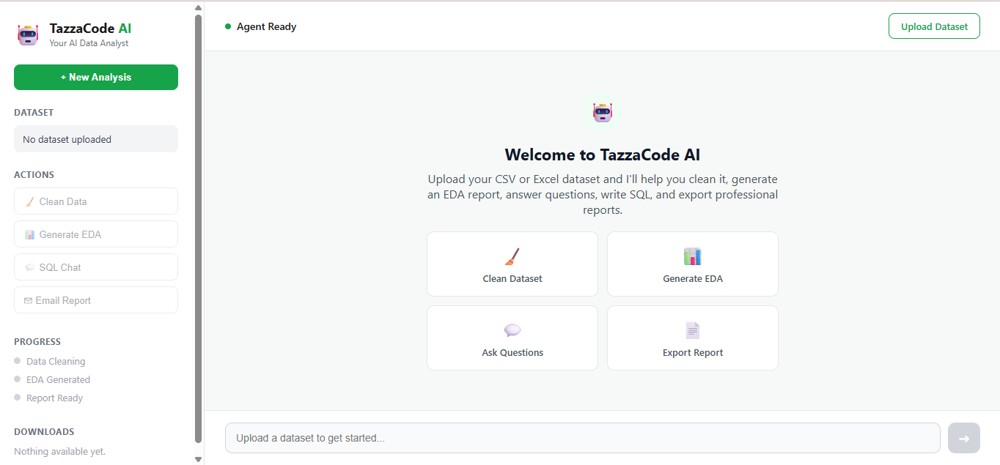
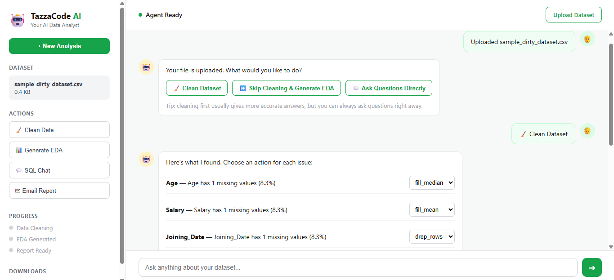
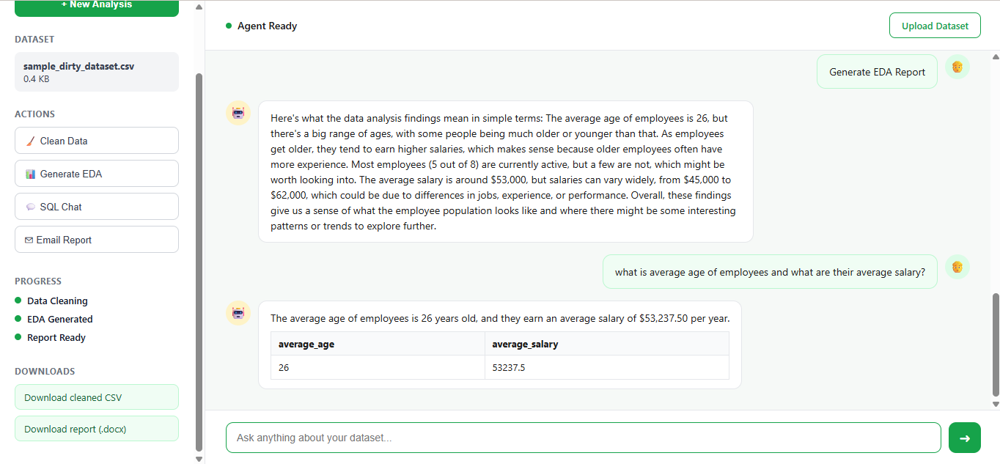
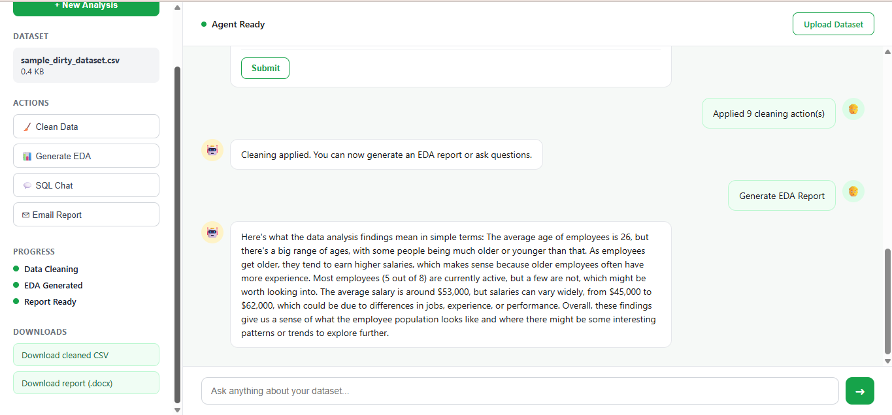

# 🤖 TazzaCode AI

**A multi-agent AI system that cleans your data, analyzes it, writes a report about it, and answers your questions — all with a human staying in control at every important decision.**

[](https://tazzacode-ai-frontend.onrender.com/)


## 🔗 **[Live Link](https://tazzacode-ai-frontend.onrender.com/)**

---

## 📸 Screenshots

| Home Page | Cleaning Approval |
|---|---|
|  |  |

| Chat with SQL Answers | EDA Summary |
|---|---|
|  |  |

---

## 💡 The Problem

Before anyone can answer a real business question with data, they usually spend
significant time on repetitive prep work: checking for missing values, fixing
inconsistent formatting, generating basic summary statistics. Most "AI data
analyst" tools either skip this step entirely (and quietly give wrong answers
on dirty data) or automate it silently (and take control away from the person
who actually understands the data).

## ✅ The Solution

TazzaCode AI is built around **human-in-the-loop control** and **multi-agent
specialization** rather than one large prompt trying to do everything:

- A dedicated **cleaning agent** detects data quality issues using deterministic
  logic — no LLM guesswork on things that don't need it
- The user **reviews and approves every cleaning decision** individually, with
  the graph genuinely pausing and resuming via LangGraph's `interrupt()`
- An **EDA agent** computes real statistics and generates charts
- A **report agent** writes both a formal analytical report and a separate
  plain-language summary, assembled into a downloadable Word document
- An **analyst agent** answers natural-language questions with real SQL queries
  against your actual data — not hallucinated numbers
- A **validator agent** double-checks every answer against the data before
  showing it, retrying if it doesn't hold up

## 🏗️ Architecture

```
                     ┌──────────────┐
   Upload ──────────▶│  Dispatcher   │
                     └──────┬───────┘
             ┌──────────────┼──────────────┬───────────────┐
             ▼              ▼              ▼               ▼
      Cleaning Agent   Analyst Agent   EDA Agent      Final Agent
     (detect issues)  (SQL + reasoning) │              (email/export)
             │              │           ▼
             ▼              ▼    Report Generation
     ⏸ Human Review    Validator Agent    (LLM-written .docx)
     (approve/choose)   (checks answer)
             │              │
             ▼              ▼
      Apply Cleaning    Show Answer
      (loop or done)
```

Each user action (clean, ask a question, generate report, export) runs as an
independent, resumable graph execution, checkpointed to PostgreSQL — so a
session can pause for minutes (while a user reviews cleaning issues) and resume
exactly where it left off, even across separate HTTP requests.

## 🧠 Key Design Decisions

- **Deterministic detection, LLM interpretation** — cleaning issue detection is
  plain pandas logic (cheap, reliable, testable); the LLM is reserved for tasks
  that genuinely need language understanding or generation
- **Real SQL, not hallucinated numbers** — the analyst agent writes actual SQL
  executed via DuckDB against the live dataframe, so every answer is grounded
- **A second pass validates the first** — the validator agent checks answers
  against real data before the user ever sees them, with a bounded retry loop
- **Stateful, resumable by design** — Postgres-backed checkpointing means the
  system doesn't lose context between a user's actions, even minutes apart

## 🛠️ Tech Stack

| Layer | Technology |
|---|---|
| Agent orchestration | LangGraph |
| LLM inference | Groq (Llama 3.3) |
| Backend API | FastAPI |
| Database / checkpointing | PostgreSQL (Supabase) via `langgraph-checkpoint-postgres` |
| Data processing | pandas, DuckDB |
| Visualization | matplotlib, seaborn |
| Report generation | python-docx |
| Email | Resend |
| Frontend | HTML, CSS, JavaScript |
| Deployment | Render |

## ✨ Features

- Upload CSV or Excel files
-  Interactive, per-issue data cleaning with multiple fix strategies (mean/median/mode fill, drop, convert type, normalize categories, clip/flip invalid values)
-  Multi-round cleaning — review, fix, review again
-  Automated EDA with statistical summaries and auto-generated charts
-  Auto-generated Word report with both formal and plain-language sections
-  Natural-language Q&A over your data — works with or without cleaning first
-  Real SQL query generation and execution (DuckDB)
-  Multi-step reasoning for open-ended "why" questions
-  Answer validation with automatic retry
-  Download cleaned data and reports directly
-  Email your reports to yourself or others

## 🚀 Getting Started

### Prerequisites
- Python 3.11
- PostgreSQL database (local or hosted, e.g. Supabase)
- Groq API key
- Resend API key

### Backend Setup
```bash
git clone https://github.com/your-username/TazzaCode-ai.git
cd TazzaCode-AI
python -m venv venv
source venv/bin/activate   # Windows: venv\Scripts\activate
pip install -r requirements.txt
```

Create a `.env` file:
```
DATABASE_URL=your_postgres_connection_string
GROQ_API_KEY=your_groq_key
RESEND_API_KEY=your_resend_key
```

Run the backend:
```bash
uvicorn backend.main:app --reload
```

### Frontend Setup
```bash
cd frontend
python -m http.server 5500
```
Open `http://localhost:5500` in your browser. Update `API_BASE` in `app.js` if
your backend runs on a different host/port.

## 📁 Project Structure

```
TazzaCode-AI/
├── backend/
│   ├── graph/
│   │   ├── state.py
│   │   ├── graph_builder.py
│   │   └── nodes/
│   │       ├── clean_agent.py
│   │       ├── eda_agent.py
│   │       ├── report_generation_agent.py
│   │       ├── analyst_agent.py
│   │       ├── validator_agent.py
│   │       └── final_agent.py
│   ├── tools/
│   │   ├── sql_tool.py
│   │   └── email_tool.py
│   └── main.py
├── frontend/
│   ├── index.html
│   ├── style.css
│   └── app.js
├── requirements.txt
├── runtime.txt
└── README.md
```

## 🔮 Future Improvements

- Move file storage from local disk to S3 for production durability
- Add authentication and per-user session ownership
- Sandboxed code execution (E2B) for more flexible, LLM-written analysis code
- Automated evaluation suite for answer accuracy
- LLM provider fallback (Claude/GPT) for reliability
- Verified email sending domain for unrestricted delivery

## 📄 License

MIT

## 🙋 About

Built by YUVRAJ SINGH RATHORE as a hands-on project to learn agentic AI system design —
multi-agent orchestration, human-in-the-loop workflows, and building a complete,
deployed application around an LLM-powered core.

[[LinkedIn](https://www.linkedin.com/in/yuvrajrathore54/)] · [[GitHub](https://github.com/yuvrajrathore672)] · [[Portfolio](https://yuvrajrathore672.github.io/YuvrajPortfolio/)]
